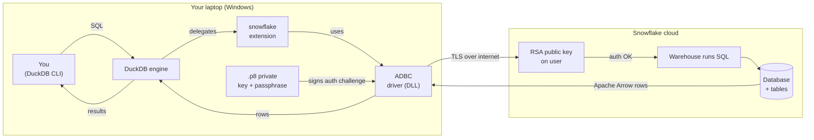

# Querying-Snowflake-data-locally-via-DuckDB
> Query Snowflake **locally from DuckDB** — no Python ETL, no Snowflake driver headaches, no warehouse credits burned on exploratory work. With key-pair authentication and reusable boot scripts.

---

## Why

Snowflake is great for storage and heavy compute, but every interactive query costs credits and pulls you into a Snowflake client. DuckDB is a free, embedded analytics engine that runs as a single `.exe` on your laptop — fast on local files, but historically had no way to reach into Snowflake.

The `snowflake` community extension changes that. After setup, this is a valid query:

```sql
SELECT * FROM snowflake_db.my_schema.my_table WHERE customer_id = 7;
```

DuckDB parses it → the extension translates it → an ADBC driver carries it over the wire → Snowflake executes → results come back as Apache Arrow. From your side, Snowflake is just another database attached to DuckDB.

This unlocks three things that used to take real Python plumbing:
- **JOIN Snowflake tables with local CSV/Parquet** in one SQL statement
- **Materialize once locally**, then iterate for free without spending warehouse credits
- **Use any DuckDB extension** (`spatial`, `iceberg`, etc.) against Snowflake data

---

## Architecture



Four pieces have to physically exist for the chain to work:

1. **DuckDB CLI** — installed via `winget`
2. **`snowflake` community extension** — installed inside DuckDB
3. **ADBC Snowflake driver** (`libadbc_driver_snowflake.so`) — inside DuckDB's extensions folder
4. **Authentication** — a private key on your disk + matching public key registered on your Snowflake user

If any one is missing or in the wrong place, the next piece errors out.

---

## Prerequisites

| Requirement | How to check / install |
|---|---|
| **Windows 10/11** | PowerShell 5.1+ is fine (built in) |
| **`winget`** | Pre-installed on Windows 10 21H2+ / Windows 11 |
| **OpenSSL** | `winget install ShiningLight.OpenSSL` |
| **Snowflake account** | With permission to `ALTER USER` your own user |

---

## Setup

### Step 1 — Install DuckDB

```powershell
winget install --exact --id DuckDB.cli
```

Close and reopen PowerShell, then verify:

```powershell
duckdb -c "SELECT version();"
```


### Step 2 — Install the ADBC driver

The article's `curl | sh` install script is bash-only; this is the PowerShell equivalent.

```powershell
$duckdbVersion = "v1.5.3"   # match what you saw in Step 1
$dir = "$env:USERPROFILE\.duckdb\extensions\$duckdbVersion\windows_amd64"
New-Item -ItemType Directory -Force -Path $dir | Out-Null

$url   = "https://github.com/apache/arrow-adbc/releases/download/apache-arrow-adbc-20/adbc_driver_snowflake-1.8.0-py3-none-win_amd64.whl"
$wheel = "$dir\driver.whl"

Invoke-WebRequest -Uri $url -OutFile $wheel -UseBasicParsing

Add-Type -AssemblyName System.IO.Compression.FileSystem
$zip   = [System.IO.Compression.ZipFile]::OpenRead($wheel)
$entry = $zip.Entries | Where-Object { $_.FullName -eq "adbc_driver_snowflake/libadbc_driver_snowflake.so" }
[System.IO.Compression.ZipFileExtensions]::ExtractToFile(
    $entry, "$dir\libadbc_driver_snowflake.so", $true)
$zip.Dispose()
Remove-Item $wheel
```

You should now have a ~123 MB file at `…\windows_amd64\libadbc_driver_snowflake.so`. Yes, `.so` on Windows — the extension v0.1.0 expects that exact name. The file inside is a real Windows DLL (its first two bytes are `4D 5A`, the PE header), just packaged with a Linux-style filename.

### Step 3 — Generate an RSA key pair

```powershell
$keyDir = ".\keys"
New-Item -ItemType Directory -Force -Path $keyDir | Out-Null
$passphrase = "<YOUR_STRONG_PASSPHRASE>"   # save this to a password manager FIRST

openssl genrsa -out "$keyDir\rsa_temp.pem" 2048
openssl pkcs8 -topk8 -v2 aes-256-cbc -inform PEM `
    -in  "$keyDir\rsa_temp.pem" `
    -out "$keyDir\snowflake_rsa_key.p8" `
    -passout "pass:$passphrase"
openssl rsa -in "$keyDir\snowflake_rsa_key.p8" `
    -passin "pass:$passphrase" -pubout `
    -out "$keyDir\snowflake_rsa_key.pub"
Remove-Item "$keyDir\rsa_temp.pem"

# Print the Snowflake-format public key (one line, no PEM headers)
$pub = Get-Content "$keyDir\snowflake_rsa_key.pub" -Raw
($pub -replace '-----BEGIN PUBLIC KEY-----','' -replace '-----END PUBLIC KEY-----','' -replace '\s','')
```

Copy the one-line output — you'll paste it into Snowflake next.

### Step 4 — Register the key + create playground data

In a Snowsight worksheet:

```sql
USE ROLE SECURITYADMIN;
ALTER USER <YOUR_SNOWFLAKE_USER>
  SET RSA_PUBLIC_KEY='<paste the one-line base64 here>';

-- Verify: RSA_PUBLIC_KEY_FP should show a SHA256:... fingerprint
DESC USER <YOUR_SNOWFLAKE_USER>;

-- Playground dataset
USE ROLE SYSADMIN;
USE WAREHOUSE <YOUR_WAREHOUSE>;
CREATE DATABASE IF NOT EXISTS DUCKDB_PLAYGROUND;
USE DATABASE DUCKDB_PLAYGROUND;
CREATE SCHEMA IF NOT EXISTS GREYBEAM_SCHEMA;
USE SCHEMA GREYBEAM_SCHEMA;

CREATE OR REPLACE TABLE MY_TABLE (
  customer_id INT, customer_name STRING, region STRING,
  signup_date DATE, lifetime_value NUMBER(12,2)
);

INSERT INTO MY_TABLE VALUES
  (1,'Acme Corp','US-East','2024-01-15',12450.50),
  (2,'Bravo Holdings','EMEA','2024-02-03',8200.00),
  (3,'Charlie Industries','APAC','2024-03-22',19800.75),
  (4,'Delta Logistics','US-West','2024-05-11',3400.00),
  (5,'Echo Retail','EMEA','2024-06-18',6750.25),
  (6,'Foxtrot Foods','APAC','2024-08-04',11200.00),
  (7,'Golf Pharma','US-East','2024-09-29',27500.90),
  (8,'Hotel Hospitality','EMEA','2024-10-14',4500.00);
```

### Step 5 — Install the snowflake extension in DuckDB

Open DuckDB at a playground database file:

```powershell
duckdb playground.duckdb
```

At the `D` prompt:

```sql
INSTALL snowflake FROM community;
LOAD snowflake;
SELECT snowflake_version();
```


`INSTALL` is one-time per DuckDB version; `LOAD` happens every session.

### Step 6 — Configure your boot script

Copy the template:

```powershell
Copy-Item sql\connect.template.sql sql\connect.sql
```

Open `sql\connect.sql` and fill in the placeholders (`<YOUR_SNOWFLAKE_ACCOUNT>`, `<YOUR_SNOWFLAKE_USER>`, `<ABSOLUTE_PATH_TO_KEY>`, `<YOUR_PASSPHRASE>`, `<YOUR_DATABASE>`, `<YOUR_WAREHOUSE>`).

> `connect.sql` is in `.gitignore` — your real credentials never get committed.

---

## Run it

```powershell
duckdb playground.duckdb -init sql\connect.sql
```

The `-init` flag runs your boot script first (LOAD + CREATE SECRET + ATTACH), then drops you at the `D` prompt with Snowflake already mounted.

### Verify it works

```sql
SELECT region, COUNT(*) AS n, SUM(lifetime_value) AS total_ltv
FROM snowflake_db.greybeam_schema.my_table
GROUP BY region
ORDER BY total_ltv DESC;
```


That aggregate ran on Snowflake's warehouse and returned 4 rows to DuckDB — not all 8 raw rows. Which brings us to…

### Bonus — see pushdown in action

```sql
EXPLAIN
SELECT region, COUNT(*) FROM snowflake_db.greybeam_schema.my_table GROUP BY region;
```


Read the plan bottom-up. The `SNOWFLAKE_TABLE_SCAN` at the bottom shows `Projections: REGION` — only the `region` column was pulled from Snowflake. Everything else (the COUNT, the GROUP BY) happens locally on a tiny slice of data. That's the cost-saving knob `enable_pushdown true` enables.

---

## Project layout

```
snowflake-x-duckdb/
├── README.md
├── .gitignore                      ← keeps secrets and binaries out
├── sql/
│   ├── connect.template.sql        ← placeholders for your account/key/passphrase
│   └── demos.sql                   ← sample queries above, ready to run
└── data/
    └── local_regions.csv           ← for cross-source JOIN examples
```

Created locally, never committed: `sql/connect.sql`, `keys/`, `playground.duckdb`.

---

